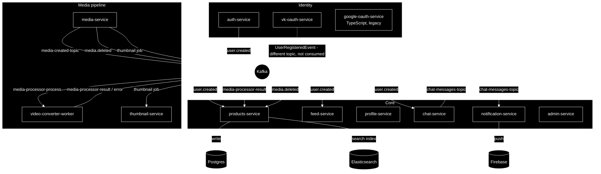

# matreshka

> A microservices marketplace/social platform — listings, video feed, chat, and the infrastructure behind them.

This is the monorepo root: each service lives on its **own branch**, named after the service. `main` holds only this document — no application code, no cluster config, no manifests. Deployment manifests and monitoring config carry live credentials for the current cluster, so they're never committed; they live only on the deploying machine, gitignored per service branch.

## Services

| Branch | Directory | Stack | Responsibility |
|---|---|---|---|
| `auth-service` | auth-service | Java / Spring Boot | Registration, login, email verification, JWT issuance |
| `vk-oauth-service` | vk-oauth | Java / Spring Boot | "Sign in with VK" |
| `google-oauth-service` | google-oauth-service | TypeScript / Prisma | "Sign in with Google" *(not yet ported to Java)* |
| `advert-service` | products-service | Java / Spring Boot | Listings (adverts): CRUD, search, media linking |
| `feed-service` | feed-service | Java / Spring Boot | Video feed: metadata, views, favorites |
| `profile-service` | profile-service | Java / Spring Boot | User profiles, employees, reviews |
| `chat-service` | chat-service | Java / Spring Boot | Real-time messaging (WebSocket/STOMP) |
| `notification-service` | notification-service | Java / Spring Boot | Push notifications (Firebase) |
| `media-service` | media-service | Java / Spring Boot | Media upload, storage orchestration |
| `video-converter-worker` | video-converter-worker | Java / Spring Boot | Video transcoding (ffmpeg → S3) |
| `thumbnail-service` | thumbnail-service | Java / Spring Boot | Thumbnail generation (ffmpeg → S3) |
| `admin-service` | admin-service | Java / Spring Boot | Platform administration *(early stage)* |
| `cryptography-app` | cryptography-app | Java / Spring Boot | AES-GCM encrypt/decrypt utility *(standalone, not wired in)* |

## System design

*The dashed edge is a known integration gap, not aspirational design — see below.*

### Kafka is the backbone

Every service talks through Kafka — `auth-service` and the media pipeline included. `auth-service` is the source of truth for the `user.created` topic, written via a **transactional outbox** (the event is committed in the same DB transaction as the user row, then relayed by a background worker); `products-service`, `feed-service`, and `chat-service` are its only real consumers.

`vk-oauth-service` also publishes to Kafka (`UserRegisteredEvent`, via `StreamBridge`), but to a different topic than `user.created` — so a VK sign-up doesn't currently fan out to the other services the way a password sign-up does. That's a routing gap to close, not a broker problem. `google-oauth-service` is the one straggler: still TypeScript/Prisma rather than the Java/Kafka pattern `vk-oauth-service` and `profile-service` already migrated to, so it isn't in the diagram's Kafka flow at all yet — porting it is the natural next step.

`thumbnail-service` is mid-migration off RabbitMQ onto Kafka to match the rest of the pipeline — the diagram already shows the target topology.

### Reliability patterns in use

- **Transactional outbox** (`auth-service`) — see above; a Kafka outage delays `user.created`, it doesn't lose it.
- **Retry + DLQ** (`products-service`, consuming `media-processor-result`) — a message that fails repeatedly (e.g. the advert isn't in Postgres yet when the media event arrives) is retried with backoff before landing in a dead-letter topic instead of being silently dropped.
- **CQRS** (`products-service`) — writes go to Postgres; on commit the same advert is projected into Elasticsearch, which serves search/read traffic.

### Data stores — one database per service

No service reaches into another's database — every service owns its schema outright, and the only way to learn about another service's data is the Kafka events above or that service's own API. Most services also run their own Redis in front of their own store, purely as a local cache — not a shared one.

| Service | Store(s) it owns |
|---|---|
| auth-service | PostgreSQL + Redis |
| vk-oauth-service | PostgreSQL + Redis |
| google-oauth-service | PostgreSQL (via Prisma) |
| products-service | PostgreSQL + Elasticsearch (search index) + Redis |
| feed-service | PostgreSQL + Redis |
| profile-service | PostgreSQL + Redis |
| chat-service | MongoDB (rooms/messages) + PostgreSQL (user mirror) + Redis |
| notification-service | PostgreSQL + Redis |
| media-service | PostgreSQL + Redis |
| video-converter-worker | none — stateless, S3 in/out only |
| thumbnail-service | PostgreSQL + Redis |
| admin-service | PostgreSQL + Redis |
| cryptography-app | PostgreSQL |

Outside the per-service stores: S3-compatible object storage (Beget Cloud) for `media-service`/`video-converter-worker`/`thumbnail-service`, Elasticsearch doubling as the platform-wide logging backend, and Firebase for `notification-service` push delivery.

### Known gaps

- VK and Google sign-ups aren't wired into the `user.created` fan-out that password sign-ups get — see "Kafka is the backbone" above.
- `google-oauth-service` hasn't made the TypeScript → Java / Kafka jump that `vk-oauth-service` and `profile-service` already went through.
- `thumbnail-service` is being rewritten from RabbitMQ to Kafka; `build.gradle` still carries the old `spring-cloud-stream-binder-rabbit` dependency until that lands.
- `cryptography-app` has a working `CryptoService` (AES/GCM, random IV per call) but no HTTP layer and no caller yet; it's a standalone module waiting to be adopted.
- `admin-service` is early-stage — infrastructure (Postgres, Redis, Kafka) is wired, feature surface is minimal.

## Working in this repo

Each service branch is self-contained — clone/checkout the branch you need, it doesn't depend on `main` being checked out alongside it. `main` is documentation only: no yml/yaml/json, no manifests, no config — those are gitignored on every branch that has them, and never committed.
