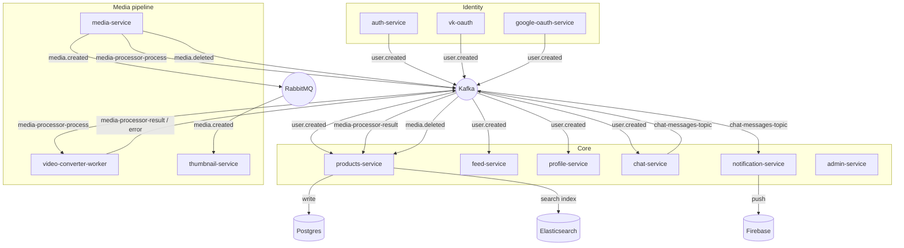

# matreshka

> A microservices marketplace/social platform — listings, video feed, chat, and the infrastructure behind them.

This is the monorepo root: each service lives on its **own branch**, named after the service. `main` holds only cross-cutting documentation and shared cluster configuration — no application code.

## Services

| Branch | Service | Responsibility |
|---|---|---|
| `advert-service` | **products-service** | Listings (adverts): CRUD, search, media linking |
| `auth-service` | **auth-service** | Registration, login, email verification, JWT issuance |
| `vk-oauth-service` | **vk-oauth** | "Sign in with VK" |
| `google-oauth-service` | google-oauth-service | "Sign in with Google" |
| `profile-service` | **profile-service** | User profiles, employees, reviews |
| `feed-service` | **feed-service** | Video feed: metadata, views, favorites |
| `chat-service` | **chat-service** | Real-time messaging (WebSocket/STOMP) |
| `notification-service` | **notification-service** | Push notifications (Firebase) |
| `media-service` | media-service | Media upload, storage orchestration |
| `video-converter-worker` | **video-converter-worker** | Video transcoding (ffmpeg → S3) |
| `thumbnail-service` | **thumbnail-service** | Thumbnail generation (ffmpeg → S3) |
| `admin-service` | admin-service | Platform administration *(early stage)* |
| `cryptography-app` | cryptography-app | Standalone crypto utility *(not yet wired in)* |

## System design

### Why two message brokers

Kafka is the default backbone (durable log, consumer groups, replay). `thumbnail-service` predates the Kafka migration and still runs on RabbitMQ for its inbound queue — not yet migrated.

### Identity: three sources, one event

Auth can happen via password (`auth-service`), VK OAuth, or Google OAuth. All three converge on the same `user.created` event shape, so every downstream service (`products-service`, `feed-service`, `profile-service`, `chat-service`) only needs one consumer regardless of how the user actually signed up.

### Reliability patterns in use

- **Transactional outbox** (`auth-service`) — the `user.created` event is written to an outbox table in the same DB transaction as the user row, then a background worker publishes it. A Kafka outage can delay the event, not lose it.
- **Retry + DLQ** (`products-service`, consuming `media-processor-result`) — a message that fails repeatedly (e.g. the advert isn't in Postgres yet when the media event arrives) is retried with backoff before landing in a dead-letter topic instead of being silently dropped.
- **CQRS** (`products-service`) — writes go to Postgres; on commit the same advert is projected into Elasticsearch, which serves search/read traffic.

### Data stores

| Store | Used by |
|---|---|
| PostgreSQL | auth, products, profile, feed, notification, thumbnail metadata |
| MongoDB | chat-service (rooms/messages) |
| Elasticsearch | products-service (search), platform logging |
| Redis | caching across most services |
| S3-compatible (Beget Cloud) | media, thumbnails |
| Firebase | push notification delivery |

### Observability

Prometheus + Grafana (metrics), Loki + Promtail (logs), OpenTelemetry/Tempo (tracing) — see `grafana.yml`, `loki-config.yml`, `promtail.yml`, `prometheus.yml`, `datasources.yml`, `minimal-monitoring.yaml` in this branch.

### Deployment

Kubernetes, behind Traefik ingress (`ingress-traefik.yaml`). Each service branch has its own `deployment.sh` + k8s manifest; the manifests are **not version-controlled** (they carry plaintext credentials for the current cluster) — they live only on the deploying machine, and are rotated independently of git history.

## Working in this repo

Each service branch is self-contained — clone/checkout the branch you need, it doesn't depend on `main` being checked out alongside it. `main` is documentation + shared cluster config only.
